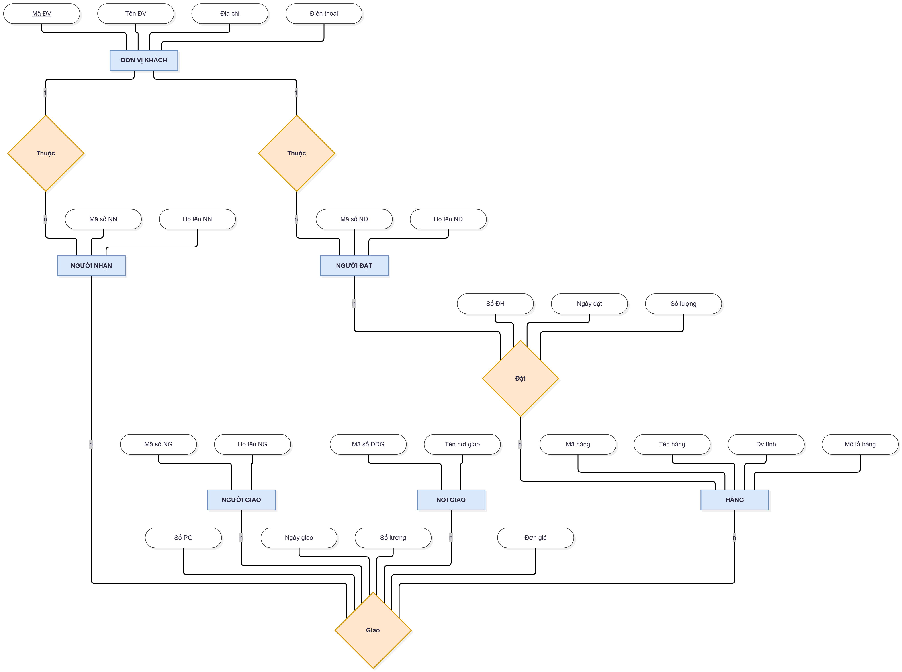
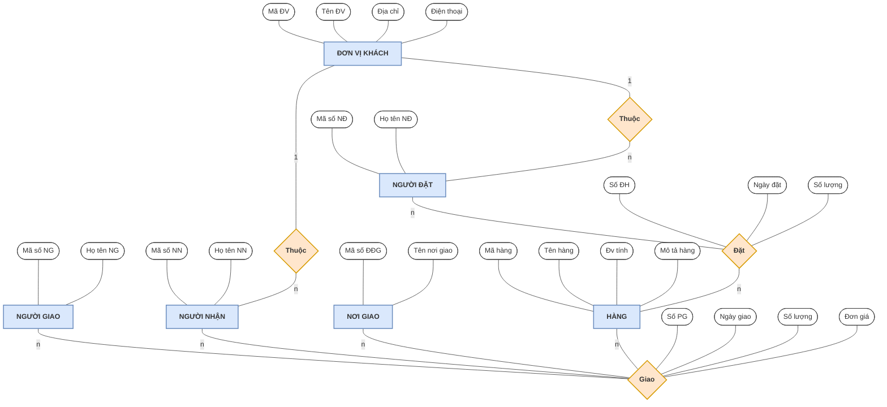

# Bài tập thực hành: Quản lý đơn đặt hàng (Sơ đồ ERD)

## Hình ảnh sơ đồ ERD

## Chi tiết mô hình ERD (Sau khi chuẩn hóa)

```mermaid
flowchart TD
    classDef entity fill:#dae8fc,stroke:#6c8ebf,stroke-width:2px,font-weight:bold;
    classDef rel fill:#ffe6cc,stroke:#d79b00,stroke-width:2px,font-weight:bold;
    classDef attr fill:#ffffff,stroke:#333333,stroke-width:1px;

    DV[ĐƠN VỊ KHÁCH]:::entity
    ND[NGƯỜI ĐẶT]:::entity
    NN[NGƯỜI NHẬN]:::entity
    NG[NGƯỜI GIAO]:::entity
    DDG[NƠI GIAO]:::entity
    HANG[HÀNG]:::entity

    dv1([Mã ĐV]):::attr --- DV
    dv2([Tên ĐV]):::attr --- DV
    dv3([Địa chỉ]):::attr --- DV
    dv4([Điện thoại]):::attr --- DV

    nd1([Mã số NĐ]):::attr --- ND
    nd2([Họ tên NĐ]):::attr --- ND

    nn1([Mã số NN]):::attr --- NN
    nn2([Họ tên NN]):::attr --- NN

    ng1([Mã số NG]):::attr --- NG
    ng2([Họ tên NG]):::attr --- NG

    ddg1([Mã số ĐĐG]):::attr --- DDG
    ddg2([Tên nơi giao]):::attr --- DDG

    h1([Mã hàng]):::attr --- HANG
    h2([Tên hàng]):::attr --- HANG
    h3([Đv tính]):::attr --- HANG
    h4([Mô tả hàng]):::attr --- HANG

    R_THUOC1{Thuộc}:::rel
    R_THUOC2{Thuộc}:::rel
    R_DAT{Đặt}:::rel
    R_GIAO{Giao}:::rel

    DV ---|1| R_THUOC1 ---|n| ND
    DV ---|1| R_THUOC2 ---|n| NN

    ND ---|n| R_DAT ---|n| HANG
    dat1([Số ĐH]):::attr --- R_DAT
    dat2([Ngày đặt]):::attr --- R_DAT
    dat3([Số lượng]):::attr --- R_DAT

    NG ---|n| R_GIAO
    NN ---|n| R_GIAO
    DDG ---|n| R_GIAO
    HANG ---|n| R_GIAO
    giao1([Số PG]):::attr --- R_GIAO
    giao2([Ngày giao]):::attr --- R_GIAO
    giao3([Số lượng]):::attr --- R_GIAO
    giao4([Đơn giá]):::attr --- R_GIAO
```
